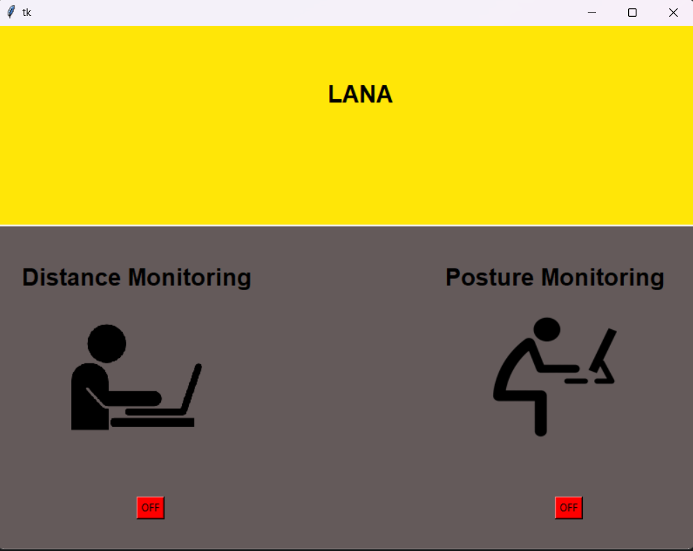

# Lana - Eye Distance and Neck Posture Monitor

## Overview

Lana is a Python application that utilizes the OpenCV library and your computer's camera to help you maintain a healthy eye distance from the screen and a proper neck posture while using your computer. Prolonged screen time and poor posture can lead to various health issues, and Lana is here to assist you in maintaining good habits.



## Features

- **Eye Distance Monitoring:** Lana tracks the distance between your eyes and the screen, providing real-time feedback to help you maintain an optimal eye-screen distance.

- **Neck Posture Detection:** Lana also analyzes your neck posture, alerting you if you assume a position that may strain your neck.

- **User-Friendly Interface:** Lana comes with a user-friendly graphical interface that displays your eye distance and neck posture status in real time.

## Requirements

- Python 3.6 or higher
- OpenCV library (cv2)
- Webcam or camera-enabled device

## Installation

1. Clone this repository to your local machine:

   ```bash
   git clone https://github.com/yourusername/lana.git
   ```

2. Install the required Python libraries using pip:

   ```bash
   pip install -r requirements.txt
   ```

## Usage

1. Run the Lana application:

   ```bash
   python lana.py
   ```

2. Position your webcam or camera-enabled device in a way that it captures your face and the screen.

3. Lana will start monitoring your eye distance and neck posture in real time.

4. Follow the on-screen feedback to maintain an optimal eye-screen distance and correct neck posture.

## Customization

You can customize Lana to fit your specific needs:

- Adjust the optimal eye-screen distance threshold in the `config.py` file.

- Customize the feedback messages and alerts in the `config.py` file.

- Modify the graphical user interface to better suit your preferences.

## Troubleshooting

If you encounter any issues while using Lana or have suggestions for improvement, please [open an issue](https://github.com/yourusername/lana/issues) on our GitHub repository.

## Contributing

We welcome contributions to make Lana even better. If you'd like to contribute, please follow our [contribution guidelines](CONTRIBUTING.md).

## License

This project is licensed under the MIT License - see the [LICENSE](LICENSE) file for details.

## Acknowledgments

Lana was inspired by the need for maintaining good posture and eye health during extended computer usage. We'd like to thank the open-source community and the developers behind the OpenCV library for making this project possible.

## Disclaimer

Lana is intended to provide guidance and reminders for maintaining healthy computer habits. It is not a substitute for professional medical advice. Consult a healthcare professional if you have concerns about your eye health or posture.

---

**Note:** Replace "yourusername" in the installation and troubleshooting sections with your actual GitHub username if you plan to host this project on GitHub.
